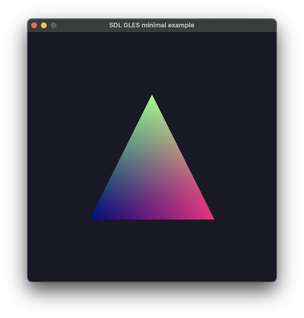

# gles-for-mac



Simplify development of native Mac apps using OpenGLES (GLES) and SDL2.

Having a Mac native GLES + SDL2 build can be helpful when developing for Emscripten and WebGL, to aid in debugging and comparison between native and web builds.  More generally, having GLES available enables continuing to do general OpenGL-like development in a Mac environment.

While Apple has dropped OpenGL and GLES in favor of Metal, Google's ANGLE project can be used to fill the void.  ANGLE provides hardware accelerated GLES in Chromium browsers across many platforms, including Mac.  So by packaging up the ANGLE GLES headers and libraries here, GLES development on Mac is restored.

Specifically, this repository provides:
- Ready-to-use GLES headers and libraries, without having to download and build ANGLE.
- A very minimal GLES + SDL2 hello triangle sample that builds to Mac executable and Emscripten web page.  
  All code is in one file, with the same code building to Mac and Emscripten, save for a few short #ifdef's. Build instructions are included.
- Steps to obtain the latest GLES headers via ANGLE and the latest GLES libraries via Chrome.
- Steps to build ANGLE from scratch, should you want to build GLES libraries yourself.  
  NOTE: The ANGLE build consumes ~35GB as of June 2024.
  
Thanks to [grplyer](https://github.com/grplyler) and [Peter0x44](https://github.com/Peter0x44) for the [steps](https://medium.com/@grplyler/building-and-linking-googles-angle-with-raylib-on-macos-67b07cd380a3) to copy GLES libraries from a local Chrome installation and for building ANGLE.
    
### Install requirements
```
# Clone gles-for-mac
git clone https://github.com/erik-larsen/gles-for-mac.git

# Set your path to gles-for-mac (NOTE: add this to your ~/.zshrc)
export GLES_FOR_MAC=/path/to/gles-for-mac
export DYLD_FALLBACK_LIBRARY_PATH=$GLES_FOR_MAC/lib

# Install Apple Developer Command Line Tools
xcode-select --install

# Install Homebrew
/bin/bash -c "$(curl -fsSL https://raw.githubusercontent.com/Homebrew/install/HEAD/install.sh)"

# Install SDL2 and Emscripten
brew install sdl2
brew install emscripten
```

### Build sample app - Mac native
```
clang sdl_gles_minimal.c -o sdl_gles_minimal $(sdl2-config --cflags --libs) -I$GLES_FOR_MAC/include -L$GLES_FOR_MAC/lib -l GLESv2 -l EGL
./sdl_gles_minimal
```
See also build_mac.sh and clean.sh.

### Build sample app - Emscripten
```
emcc sdl_gles_minimal.c -s USE_SDL=2 -s FULL_ES2=1 -o sdl_gles_minimal.html
emrun sdl_gles_minimal.html
```
See also build_emscripten.sh and clean.sh.

### Obtain the latest GLES headers and libraries
```
# Copy ANGLE GLES headers to gles-for-mac
git clone https://chromium.googlesource.com/angle/angle
export ANGLE=/path/to/angle
cp -r $ANGLE/include/EGL   $GLES_FOR_MAC/include
cp -r $ANGLE/include/GLES  $GLES_FOR_MAC/include
cp -r $ANGLE/include/GLES2 $GLES_FOR_MAC/include
cp -r $ANGLE/include/KHR   $GLES_FOR_MAC/include

# Copy Chrome GLES libraries to gles-for-mac
install Chrome: https://www.google.com/chrome/browser-tools/    
cp "/Applications/Google Chrome.app/Contents/Frameworks/Google Chrome Framework.framework/Versions/Current/Libraries/libGLESv2.dylib" $GLES_FOR_MAC/lib
cp "/Applications/Google Chrome.app/Contents/Frameworks/Google Chrome Framework.framework/Versions/Current/Libraries/libEGL.dylib" $GLES_FOR_MAC/lib
```

### Build ANGLE from scratch
```
# Install Ninja, Cmake, and Python 3
brew install ninja
brew install cmake
brew install python

# Install depot_tools
git clone https://chromium.googlesource.com/chromium/tools/depot_tools.git
export PATH=/path/to/depot_tools:$PATH

# Build ANGLE
git clone https://chromium.googlesource.com/angle/angle
ANGLE=/path/to/angle    
cd $ANGLE
python scripts/bootstrap.py
gclient sync
gn gen out/Release
ninja -C out/Release

# Copy ANGLE headers and libs to gles-for-mac
cp -r $ANGLE/include/EGL   $GLES_FOR_MAC/include
cp -r $ANGLE/include/GLES  $GLES_FOR_MAC/include
cp -r $ANGLE/include/GLES2 $GLES_FOR_MAC/include
cp -r $ANGLE/include/KHR   $GLES_FOR_MAC/include
cp $ANGLE/out/Release/libGLESv2.dylib $GLES_FOR_MAC/lib
cp $ANGLE/out/Release/libEGL.dylib    $GLES_FOR_MAC/lib
```
